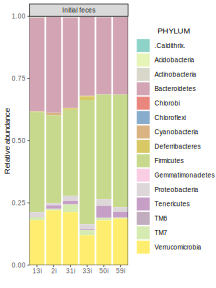
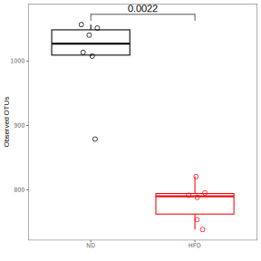
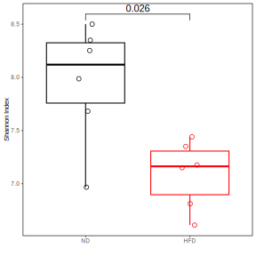
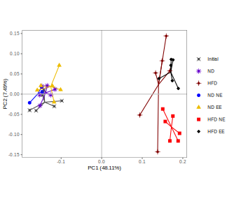
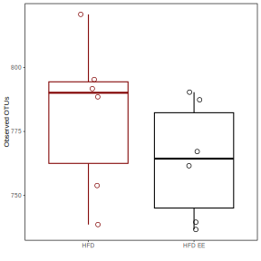
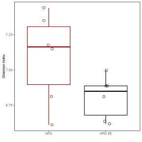
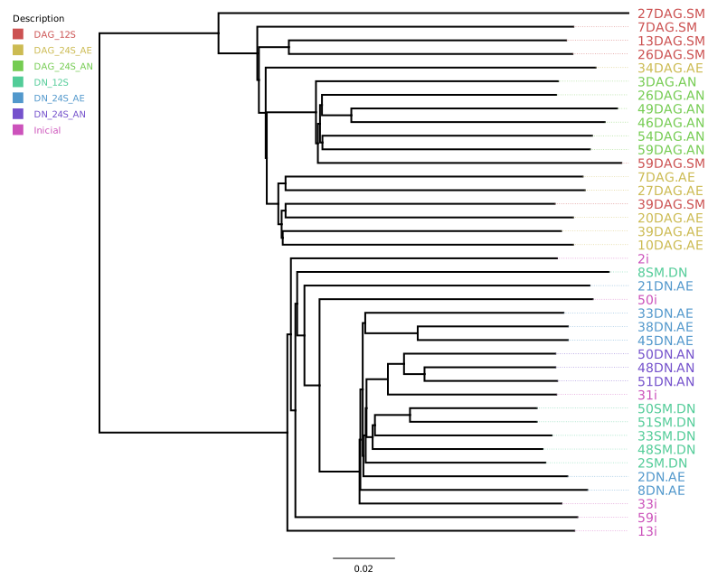

# Microbiome 16S, Rubiceli

## Taxonomy, only **Initial feces** phylum level

## Alpha diversity, ND vs HFD

## Beta diverstity, Unweighted UniFrac ND vs HFD

## Taxonomy, 12 weeks ND vs HFD species level

## Alpha diversity, NE vs EE

## Beta diversity, Unweighted UniFrac all samples

## Beta diversity, Unweighted UniFrac HFD NE vs EE

## Alpha diversity, HFD_MS vs HFD_NE

## Beta diversity, HFD_MS vs HFD_NE

## Alpha diversity, HFD_MS vs HFD_EE

## Beta diversity, HFD_MS vs HFD_EE

## Alpha diversity, HFD_MS vs HFD_NE vd HFD_EE

## Beta diversity, HFD_MS vs HFD_NE vd HFD_EE

### Anosim between groups
 
||anosim_unweighted_unifrac_dm_dag-an_dag-ae|anosim_unweighted_unifrac_dm_dag-an_dag-sm|anosim_unweighted_unifrac_dm_dag-sm_dag-ae|
|-|-|-|-|
|Sample size|12|12|12|
|Number of groups|2|2|2|
|Test statistic|0.607407407|0.492592593|0.32037037|
|p-value|0.004|0.01|0.031|
|Number of permutations|999|999|999|

## UPGMA Jackknife tree, all samples

## UPGMA Jackknife tree, HFD_MS vs HFD_NE vd HFD_EE

## Distance centroids beta diversity, all samples

## Distance centroids, HFD_MS vs HFD_NE vd HFD_EE

## Venn diagram, OTUs level HFD_MS vs HFD_NE vd HFD_EE
