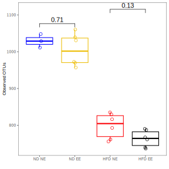

# Microbiome 16S, Rubiceli

## Taxonomy, only **Initial feces** phylum level

## Alpha diversity, ND vs HFD

## Beta diverstity, Unweighted UniFrac ND vs HFD

## Taxonomy, 12 weeks ND vs HFD species level

## Alpha diversity, NE vs EE

## Beta diversity, Unweighted UniFrac all samples

## Beta diversity, Unweighted UniFrac HFD NE vs EE

