```{r setup, include=FALSE} 
knitr::opts_chunk$set(echo = TRUE)
knitr::opts_chunk$set(engine.opts = list(bash = "-l"))
knitr::opts_knit$set(root.dir = '/Users/luigui/Documents/rubiceli_microbiome_16S')

# Packages installation
library(colorRamps)
library(ggplot2)
library(reshape)
library(scales)
library(jcolors)
library(grid)
library(RColorBrewer)
library(dplyr)
library(ggpubr)
library(ggordiplots)

```

## Taxonomy, only **Initial feces** phylum level

```{r, echo=FALSE, warning=FALSE, include=FALSE}
# Input table
table <- read.table(file = "01_taxonomy/01_tax_sample/formatted_table_L2.txt",
      header = TRUE)

# Reshape table
melted_table <- melt(table, id.vars = c("SampleID", "Description"))

# Rename headers
melted_table <- melted_table %>% 
  rename(sample = SampleID,
    group = Description,
    taxa = variable)

# Filter only taxa
filt_table <- melted_table %>% filter(grepl("k__", taxa))

filt_table$taxa <- gsub('k__Bacteria.p__', '', filt_table$taxa)

filt_table$value <- as.numeric(as.character(filt_table$value))

filt_table <- subset(filt_table, taxa != "")

# Filter only "Initial" samples
filt_table <- filt_table %>% filter(grepl("Inicial", group))

# Change name of group
filt_table$group <- recode_factor(filt_table$group, Inicial = "Initial feces")

# Colors
colourCount = length(unique(filt_table$taxa))
getPalette = colorRampPalette(brewer.pal(colourCount, "Set3"))

# Plot
barplot_tax <- ggplot(filt_table, aes(x = sample,
    y = value,
    fill = taxa)) +
geom_bar(position="fill", stat="identity") +
facet_grid(~group,
    scales = "free") +
labs(x = "",
    y = "Relative abundance",
    fill = toupper("phylum")) +
scale_x_discrete(expand = c(0, 0)) +
scale_y_continuous(limits = c(0, 1),
    expand = c(0, 0)) +
scale_fill_manual(values = getPalette(colourCount)) +
theme_test(base_size = 8,
           base_family = "Arial") +
theme(legend.title = element_text(hjust = 0.5),
      legend.key.height = unit(1, "line"),
      legend.key.width = unit(1, "line")) +
guides(fill = guide_legend(ncol = 1,
    byrow = FALSE))

# Creation of .svg
ggsave("01_taxonomy/01_tax_sample/phylum_initial-feces.svg",
       width = 3,
       height = 4)
dev.off()
```


## Taxonomy, only **Initial feces** class level

```{r, echo=FALSE, warning=FALSE, include=FALSE}
# Input table
table <- read.table(file = "01_taxonomy/01_tax_sample/formatted_table_L3_v2.txt",
      header = TRUE)

# Reshape table
melted_table <- melt(table, id.vars = c("SampleID", "Description"))

# Rename headers
melted_table <- melted_table %>% 
  rename(sample = SampleID,
    group = Description,
    taxa = variable)

# Filter only taxa
filt_table <- melted_table %>% filter(!grepl("Grupo_Experimental|Dieta|Ambiente|Tiempo",
                                             taxa))

filt_table$value <- as.numeric(as.character(filt_table$value))

# Filter only "Initial" samples
filt_table <- filt_table %>% filter(grepl("Inicial", group))

# Change name of group
filt_table$group <- recode_factor(filt_table$group, Inicial = "Initial feces")

# Colors
colourCount = length(unique(filt_table$taxa))
getPalette = colorRampPalette(brewer.pal(colourCount, "Set3"))

# Plot
barplot_tax <- ggplot(filt_table, aes(x = sample,
    y = value,
    fill = taxa)) +
geom_bar(position="fill", stat="identity") +
facet_grid(~group,
    scales = "free") +
labs(x = "",
    y = "Relative abundance",
    fill = toupper("class")) +
scale_x_discrete(expand = c(0, 0)) +
scale_y_continuous(limits = c(0, 1),
    expand = c(0, 0)) +
scale_fill_manual(values = getPalette(colourCount)) +
theme_test(base_size = 8,
           base_family = "Arial") +
theme(legend.title = element_text(hjust = 0.5),
      legend.key.height = unit(1, "line"),
      legend.key.width = unit(1, "line")) +
guides(fill = guide_legend(ncol = 2,
    byrow = TRUE))

# Creation of .svg
ggsave("01_taxonomy/01_tax_sample/class_initial-feces.svg",
       width = 4,
       height = 4)
dev.off()
```


## Taxonomy, only **Initial feces** order level

```{r, echo=FALSE, warning=FALSE, include=FALSE}
# Input table
table <- read.table(file = "01_taxonomy/01_tax_sample/formatted_table_L4_v2.txt",
      header = TRUE)

# Reshape table
melted_table <- melt(table, id.vars = c("SampleID", "Description"))

# Rename headers
melted_table <- melted_table %>% 
  rename(sample = SampleID,
    group = Description,
    taxa = variable)

# Filter only taxa
filt_table <- melted_table %>% filter(!grepl("Grupo_Experimental|Dieta|Ambiente|Tiempo",
                                             taxa))

filt_table$value <- as.numeric(as.character(filt_table$value))

# Filter only "Initial" samples
filt_table <- filt_table %>% filter(grepl("Inicial", group))

# Change name of group
filt_table$group <- recode_factor(filt_table$group, Inicial = "Initial feces")

# Colors
colourCount = length(unique(filt_table$taxa))
getPalette = colorRampPalette(brewer.pal(colourCount, "Set3"))

# Plot
barplot_tax <- ggplot(filt_table, aes(x = sample,
    y = value,
    fill = taxa)) +
geom_bar(position="fill", stat="identity") +
facet_grid(~group,
    scales = "free") +
labs(x = "",
    y = "Relative abundance",
    fill = toupper("order")) +
scale_x_discrete(expand = c(0, 0)) +
scale_y_continuous(limits = c(0, 1),
    expand = c(0, 0)) +
scale_fill_manual(values = getPalette(colourCount)) +
theme_test(base_size = 8,
           base_family = "Arial") +
theme(legend.title = element_text(hjust = 0.5),
      legend.key.height = unit(1, "line"),
      legend.key.width = unit(1, "line")) +
guides(fill = guide_legend(ncol = 3,
    byrow = TRUE))

# Creation of .svg
ggsave("01_taxonomy/01_tax_sample/order_initial-feces.svg",
       width = 5,
       height = 4)
dev.off()
```

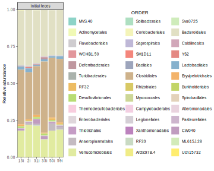

## Taxonomy, only **Initial feces** family level

```{r, echo=FALSE, warning=FALSE, include=FALSE}
# Input table
table <- read.table(file = "01_taxonomy/01_tax_sample/formatted_table_L5_v3.txt",
      header = TRUE)

# Reshape table
melted_table <- melt(table, id.vars = c("SampleID", "Description"))

# Rename headers
melted_table <- melted_table %>% 
  rename(sample = SampleID,
    group = Description,
    taxa = variable)

# Filter only taxa
filt_table <- melted_table %>% filter(!grepl("Grupo_Experimental|Dieta|Ambiente|Tiempo",
                                             taxa))

filt_table$value <- as.numeric(as.character(filt_table$value))

# Filter only "Initial" samples
filt_table <- filt_table %>% filter(grepl("Inicial", group))

# Change name of group
filt_table$group <- recode_factor(filt_table$group, Inicial = "Initial feces")

# Colors
colourCount = length(unique(filt_table$taxa))
getPalette = colorRampPalette(brewer.pal(colourCount, "Set3"))

# Plot
barplot_tax <- ggplot(filt_table, aes(x = sample,
    y = value,
    fill = taxa)) +
geom_bar(position="fill", stat="identity") +
facet_grid(~group,
    scales = "free") +
labs(x = "",
    y = "Relative abundance",
    fill = toupper("family")) +
scale_x_discrete(expand = c(0, 0)) +
scale_y_continuous(limits = c(0, 1),
    expand = c(0, 0)) +
scale_fill_manual(values = getPalette(colourCount)) +
theme_test(base_size = 8,
           base_family = "Arial") +
theme(legend.title = element_text(hjust = 0.5),
      legend.key.height = unit(1, "line"),
      legend.key.width = unit(1, "line")) +
guides(fill = guide_legend(ncol = 1,
    byrow = FALSE))

# Creation of .svg
ggsave("01_taxonomy/01_tax_sample/family_initial-feces.svg",
       width = 3,
       height = 4)
dev.off()
```


## Taxonomy, family level all samples

```{r, echo=FALSE, warning=FALSE, include=FALSE}
# Input table
table <- read.table(file = "01_taxonomy/01_tax_sample/formatted_table_L5_v3.txt",
      header = TRUE)

# Reshape table
melted_table <- melt(table, id.vars = c("SampleID", "Description"))

# Rename headers
melted_table <- melted_table %>% 
  rename(sample = SampleID,
    group = Description,
    taxa = variable)

# Filter only taxa
filt_table <- melted_table %>% filter(!grepl("Grupo_Experimental|Dieta|Ambiente|Tiempo",
                                             taxa))

filt_table$value <- as.numeric(as.character(filt_table$value))

# Change name of group
filt_table$group <- recode_factor(filt_table$group,
                                  Inicial = "Initial",
                                  DN_12S = "ND 12W",
                                  DN_24S_AE = "ND 24W EE",
                                  DN_24S_AN = "ND 24W NE",
                                  DAG_12S = "HFD 12W",
                                  DAG_24S_AE = "HFD 24W EE",
                                  DAG_24S_AN = "HFD 24W NE")

# Colors
colourCount = length(unique(filt_table$taxa))
getPalette = colorRampPalette(brewer.pal(colourCount, "Set3"))

# Plot
barplot_tax <- ggplot(filt_table, aes(x = sample,
    y = value,
    fill = taxa)) +
geom_bar(position="fill", stat="identity") +
facet_grid(~group,
    scales = "free") +
labs(x = "",
    y = "Relative abundance",
    fill = toupper("family")) +
scale_x_discrete(expand = c(0, 0)) +
scale_y_continuous(limits = c(0, 1),
    expand = c(0, 0)) +
scale_fill_manual(values = getPalette(colourCount)) +
theme_test(base_size = 8,
           base_family = "Arial") +
theme(legend.title = element_text(hjust = 0.5),
      legend.key.height = unit(1, "line"),
      legend.key.width = unit(1, "line"),
      axis.text.x = element_text(angle = 90,
                                 vjust = 0.5,
                                 hjust = 0.5)) +
guides(fill = guide_legend(ncol = 1,
    byrow = FALSE))

# Creation of .svg
# ggsave("01_taxonomy/01_tax_sample/family_allsamples.svg",
#        width = 7,
#        height = 4)
# dev.off()

# Creation of .png
ggsave("01_taxonomy/01_tax_sample/family_allsamples.png",
       width = 7,
       height = 4)
dev.off()
```

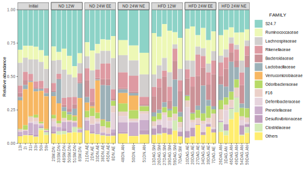


## Taxonomy, only **Initial feces** genera level

```{r, echo=FALSE, warning=FALSE, include=FALSE}
# Input table
table <- read.table(file = "01_taxonomy/01_tax_sample/formatted_table_L6_v2.txt",
      header = TRUE,
      sep='\t')

# Reshape table
melted_table <- melt(table, id.vars = c("SampleID", "Description"))

# Rename headers
melted_table <- melted_table %>% 
  rename(sample = SampleID,
    group = Description,
    taxa = variable)

# Filter only taxa
filt_table <- melted_table %>% filter(!grepl("Grupo_Experimental|Dieta|Ambiente|Tiempo",
                                             taxa))

filt_table$value <- as.numeric(as.character(filt_table$value))

# Filter only "Initial" samples
filt_table <- filt_table %>% filter(grepl("Inicial", group))

# Change name of group
filt_table$group <- recode_factor(filt_table$group, Inicial = "Initial feces")

# Colors
colourCount = length(unique(filt_table$taxa))
getPalette = colorRampPalette(brewer.pal(colourCount, "Set3"))

# Plot
barplot_tax <- ggplot(filt_table, aes(x = sample,
    y = value,
    fill = taxa)) +
geom_bar(position="fill", stat="identity") +
facet_grid(~group,
    scales = "free") +
labs(x = "",
    y = "Relative abundance",
    fill = toupper("genera")) +
scale_x_discrete(expand = c(0, 0)) +
scale_y_continuous(limits = c(0, 1),
    expand = c(0, 0)) +
scale_fill_manual(values = getPalette(colourCount)) +
theme_test(base_size = 8,
           base_family = "Arial") +
theme(legend.title = element_text(hjust = 0.5),
      legend.key.height = unit(1, "line"),
      legend.key.width = unit(1, "line")) +
guides(fill = guide_legend(ncol = 5,
    byrow = TRUE))

# Creation of .svg
ggsave("01_taxonomy/01_tax_sample/genera_initial-feces.svg",
       width = 8,
       height = 4)
dev.off()
```


## Taxonomy, only **Initial feces** species level

```{r, echo=FALSE, warning=FALSE, include=FALSE}
# Input table
table <- read.table(file = "01_taxonomy/01_tax_sample/formatted_table_L7_v2.txt",
      header = TRUE,
      sep='\t')

# Reshape table
melted_table <- melt(table, id.vars = c("SampleID", "Description"))

# Rename headers
melted_table <- melted_table %>% 
  rename(sample = SampleID,
    group = Description,
    taxa = variable)

# Filter only taxa
filt_table <- melted_table %>% filter(!grepl("Grupo_Experimental|Dieta|Ambiente|Tiempo",
                                             taxa))

filt_table$value <- as.numeric(as.character(filt_table$value))

# Filter only "Initial" samples
filt_table <- filt_table %>% filter(grepl("Inicial", group))

# Change name of group
filt_table$group <- recode_factor(filt_table$group, Inicial = "Initial feces")

# Colors
colourCount = length(unique(filt_table$taxa))
getPalette = colorRampPalette(brewer.pal(colourCount, "Set3"))

# Plot
barplot_tax <- ggplot(filt_table, aes(x = sample,
    y = value,
    fill = taxa)) +
geom_bar(position="fill", stat="identity") +
facet_grid(~group,
    scales = "free") +
labs(x = "",
    y = "Relative abundance",
    fill = toupper("specie")) +
scale_x_discrete(expand = c(0, 0)) +
scale_y_continuous(limits = c(0, 1),
    expand = c(0, 0)) +
scale_fill_manual(values = getPalette(colourCount)) +
theme_test(base_size = 8,
           base_family = "Arial") +
theme(legend.title = element_text(hjust = 0.5),
      legend.key.height = unit(1, "line"),
      legend.key.width = unit(1, "line")) +
guides(fill = guide_legend(ncol = 6,
    byrow = TRUE))

# Creation of .svg
ggsave("01_taxonomy/01_tax_sample/species_initial-feces.svg",
       width = 12,
       height = 5)
dev.off()
```


## Taxonomy, Coprococcus

```{r, echo=FALSE, warning=FALSE, include=FALSE}
# Input table
table <- read.table(file = "01_taxonomy/01_tax_sample/formatted_table_L7_Coprococcus.tsv",
      header = TRUE,
      sep = "\t")

# Reshape table
melted_table <- melt(table, id.vars = c("SampleID", "Description"))

# Rename headers
melted_table <- melted_table %>% 
  rename(sample = SampleID,
    group = Description,
    taxa = variable)

# Filter only taxa
filt_table <- melted_table %>% filter(!grepl("Grupo_Experimental|Dieta|Ambiente|Tiempo",
                                             taxa))

filt_table$value <- as.numeric(as.character(filt_table$value))

# Change name of group
filt_table$group <- recode_factor(filt_table$group,
                                  Inicial = "Initial",
                                  DN_12S = "ND 12W",
                                  DN_24S_AE = "ND 24W EE",
                                  DN_24S_AN = "ND 24W NE",
                                  DAG_12S = "HFD 12W",
                                  DAG_24S_AE = "HFD 24W EE",
                                  DAG_24S_AN = "HFD 24W NE")

# Colors
colourCount = length(unique(filt_table$taxa))
getPalette = colorRampPalette(brewer.pal(colourCount, "Set3"))

# Plot
barplot_tax <- ggplot(filt_table, aes(x = group,
    y = value,
    fill = taxa)) +
geom_boxplot() +
      geom_jitter(color="black", size=0.4, alpha=0.9) +
labs(title = "Coprococcus sp.",
     x = "",
    y = "Relative abundance",
    fill = "") +
# scale_x_discrete(expand = c(0, 0)) +
scale_fill_manual(values = getPalette(colourCount)) +
theme_test(base_size = 8,
           base_family = "Arial") +
theme(legend.position = "none",
      axis.text.x = element_text(angle = 90,
                                 vjust = 0.5,
                                 hjust = 0.5)) +
guides(fill = guide_legend(ncol = 1,
    byrow = FALSE))


barplot_tax

# Creation of .svg
ggsave("01_taxonomy/01_tax_sample/Coprococcus_allsamples.svg",
       width = 7,
       height = 4)
while (!is.null(dev.list()))  dev.off()

# Creation of .png
ggsave("01_taxonomy/01_tax_sample/Coprococcus_allsamples.png",
       width = 7,
       height = 4)
while (!is.null(dev.list()))  dev.off()

```

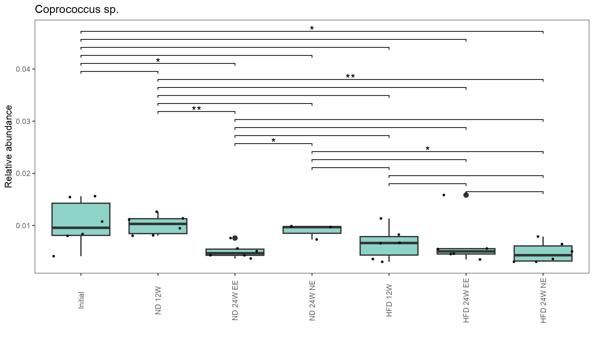


## Alpha diversity, ND vs HFD

```{r, echo=FALSE, warning=FALSE, include=FALSE}
# Input table
alpha_data <- read.table(file = "02_alpha_diversity/alpha_diversity_e24251_r10000.txt",
                         header = TRUE,
                         sep = "\t")

# Filter groups DN and DAG
filt_alpha_data <- alpha_data %>% filter(grepl('DN|DAG',
                                               Grupo_Experimental))

filt_alpha_data <- filt_alpha_data %>% filter(!grepl('_A',
                                               Grupo_Experimental))

# Change name of groups
filt_alpha_data$Grupo_Experimental <- recode_factor(filt_alpha_data$Grupo_Experimental,
                                  DAG = "HFD",
                                  DN = "ND")

filt_alpha_data <- filt_alpha_data %>% rename(group = "Grupo_Experimental")

filt_alpha_data <- filt_alpha_data %>% mutate(group = factor(group,
                                                             levels=c("ND",
                                                                      "HFD")))
# Define colors and shapes
colors <- c("#6600cc", # purple
            "#800000") # brown

shapes <- c(8, # *
            3) # +

# P-value comparisons 
p_value <- list(c("ND",
                  "HFD"))

# Observed otus boxplot
observed_otus_boxplot <- ggplot(filt_alpha_data,
                                aes(x = group,
                                    y = Observed.OTUs)) +
geom_boxplot(aes(color = group),
             outlier.shape = NA) +
geom_point(aes(color = group),
    size = 2,
    shape = 21,
    position = position_jitterdodge()) +
theme_test(base_size = 8,
           base_family = "Arial") +
labs(x = "",
    y = "Observed OTUs") +
scale_color_manual(values = colors) +
stat_compare_means(comparisons = p_value,
    method = "wilcox.test") +
theme(legend.position = "none")

# Creation of .svg
ggsave("02_alpha_diversity/observed_nd_vs_hdf.svg",
       width = 4,
       height = 4)
dev.off()

```


```{r, echo=FALSE, warning=FALSE, include=FALSE}
# Shannon boxplot
shannon_boxplot <- ggplot(filt_alpha_data,
                                aes(x = group,
                                    y = Shannon.Index)) +
geom_boxplot(aes(color = group),
             outlier.shape = NA) +
geom_point(aes(color = group),
    size = 2,
    shape = 21,
    position = position_jitterdodge()) +
theme_test(base_size = 8,
           base_family = "Arial") +
labs(x = "",
    y = "Shannon Index") +
scale_color_manual(values = colors) +
stat_compare_means(comparisons = p_value,
    method = "wilcox.test") +
theme(legend.position = "none")

# Creation of .svg
ggsave("02_alpha_diversity/shannon_nd_vs_hdf.svg",
       width = 4,
       height = 4)
dev.off()
```


## Beta diverstity, Unweighted UniFrac ND vs HFD

```{r, echo=FALSE, warning=FALSE, include=FALSE}
# Input table and metadata
beta_data <- read.table(file = "03_beta_diversity/01_nd_vs_hfd/unweighted_unifrac_dm.txt",
                        sep="\t",
                        header=T,
                        row.names=1,
                        check.names=F)

metadata <- read.table(file = "metadata_allsamples.txt",
                       sep="\t",
                       header=T,
                       row.names=1,
                       check.names=F)

metadata <- metadata %>% filter(grepl("D", Grupo_Experimental)) %>% filter(!grepl("_", Grupo_Experimental))

# Change the name of groups
metadata$Grupo_Experimental <- recode_factor(metadata$Grupo_Experimental,
                                             DN = "ND",
                                             DAG = "HFD")

metadata <- metadata %>% mutate(Grupo_Experimental = factor(Grupo_Experimental,
                                                            levels=c(
                                                              "ND",
                                                              "HFD")))

# Define colors and shapes
colors <- c("#6600cc", # purple
            "#800000") # brown

shapes <- c(8, # *
            3) # +

# PCoA plot
ord <- cmdscale(beta_data,
                eig = T,
                k=ncol(beta_data)-1)

plt <- gg_ordiplot(ord,
                   groups = metadata$Grupo_Experimental,
                   conf = 0.95,
                   spiders = TRUE,
                   plot = FALSE,
                   ellipse = FALSE,
                   pt.size = 1)

plt <- plt$plot +
  geom_point(data = plt$df_ord,
             aes(x = x, y = y, color = Group, shape = Group),
             size = 2) +
scale_color_manual(values = colors) +
scale_shape_manual(values = shapes) +
labs(y = "PC2 (16.55%)",
     x = "PC1 (49.09%)",
    title = "ANOSIM=0.9630; p-value=0.002") +
geom_hline(yintercept=0,
    color = "gray") +
geom_vline(xintercept=0,
    color = "gray") +
theme_test(base_size = 8,
           base_family = "Arial") +
theme(legend.title = element_blank(),
    legend.position = "right",
    legend.background = element_blank(),
    plot.title = element_text(hjust = 0.5))

plt

# Creation of .svg
ggsave("03_beta_diversity/01_nd_vs_hfd/unweighted_unifrac_nd_vs_hfd.svg",
       width = 4.5,
       height = 4)
dev.off()
```


## Taxonomy, 12 weeks ND vs HFD phylum level

```{r, echo=FALSE, warning=FALSE, include=FALSE}
# Input table
table <- read.table(file = "01_taxonomy/02_tax_group/formatted_table_L2_v2.txt",
      header = TRUE,
      sep = '\t',
      check.names = FALSE)

# Reshape table
melted_table <- melt(table, id.vars = c("group"))

# Rename headers
filt_table <- melted_table %>% 
  rename(taxa = variable)

# Filter and rename groups

filt_table <- filt_table %>% 
  filter(grepl("DAG|DN", group)) %>% 
  filter(!grepl("_", group))

filt_table$group <- recode_factor(filt_table$group,
                                  DAG = "HFD",
                                  DN = "ND")

filt_table <- filt_table %>% mutate(group = factor(group,
                                                   levels=c("ND", "HFD")))
# Colors
colourCount = length(unique(filt_table$taxa))
getPalette = colorRampPalette(brewer.pal(colourCount, "Set3"))

# Plot
barplot_tax <- ggplot(filt_table, aes(x = group,
    y = value,
    fill = taxa)) +
geom_bar(position="stack", stat="identity") +
labs(x = "",
    y = "Relative abundance",
    fill = toupper("phylum")) +
scale_x_discrete(expand = c(0, 0)) +
scale_y_continuous(limits = c(0, 1),
   expand = c(0, 0)) +
scale_fill_manual(values = getPalette(colourCount)) +
theme_test(base_size = 8,
           base_family = "Arial") +
theme(legend.title = element_text(hjust = 0.5),
      legend.key.height = unit(1, "line"),
      legend.key.width = unit(1, "line")) +
guides(fill = guide_legend(ncol = 1,
    byrow = FALSE))

# Creation of .svg
ggsave("01_taxonomy/02_tax_group/phylum_12w-ND-HFD.svg",
       width = 3,
       height = 4)
dev.off()
```


## Taxonomy, 12 weeks ND vs HFD class level

```{r, echo=FALSE, warning=FALSE, include=FALSE}
# Input table
table <- read.table(file = "01_taxonomy/02_tax_group/formatted_table_L3_v2.txt",
      header = TRUE,
      sep = '\t',
      check.names = FALSE)

# Reshape table
melted_table <- melt(table, id.vars = c("group"))

# Rename headers
filt_table <- melted_table %>% 
  rename(taxa = variable)

# Filter and rename groups

filt_table <- filt_table %>% 
  filter(grepl("DAG|DN", group)) %>% 
  filter(!grepl("_", group))

filt_table$group <- recode_factor(filt_table$group,
                                  DAG = "HFD",
                                  DN = "ND")

filt_table <- filt_table %>% mutate(group = factor(group,
                                                   levels=c("ND", "HFD")))
# Colors
colourCount = length(unique(filt_table$taxa))
getPalette = colorRampPalette(brewer.pal(colourCount, "Set3"))

# Plot
barplot_tax <- ggplot(filt_table, aes(x = group,
    y = value,
    fill = taxa)) +
geom_bar(position="stack", stat="identity") +
labs(x = "",
    y = "Relative abundance",
    fill = toupper("class")) +
scale_x_discrete(expand = c(0, 0)) +
scale_y_continuous(limits = c(0, 1),
   expand = c(0, 0)) +
scale_fill_manual(values = getPalette(colourCount)) +
theme_test(base_size = 8,
           base_family = "Arial") +
theme(legend.title = element_text(hjust = 0.5),
      legend.key.height = unit(1, "line"),
      legend.key.width = unit(1, "line")) +
guides(fill = guide_legend(ncol = 2,
    byrow = TRUE))

# Creation of .svg
ggsave("01_taxonomy/02_tax_group/class_12w-ND-HFD.svg",
       width = 5,
       height = 5)
dev.off()
```

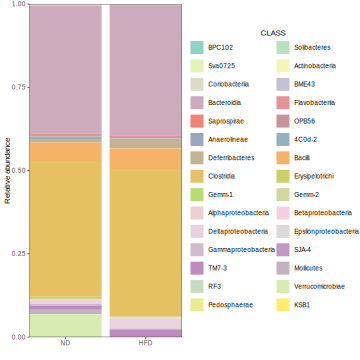


## Taxonomy, 12 weeks ND vs HFD order level

```{r, echo=FALSE, warning=FALSE, include=FALSE}
# Input table
table <- read.table(file = "01_taxonomy/02_tax_group/formatted_table_L4_v2.txt",
      header = TRUE,
      sep = '\t',
      check.names = FALSE)

# Reshape table
melted_table <- melt(table, id.vars = c("group"))

# Rename headers
filt_table <- melted_table %>% 
  rename(taxa = variable)

# Filter and rename groups

filt_table <- filt_table %>% 
  filter(grepl("DAG|DN", group)) %>% 
  filter(!grepl("_", group))

filt_table$group <- recode_factor(filt_table$group,
                                  DAG = "HFD",
                                  DN = "ND")

filt_table <- filt_table %>% mutate(group = factor(group,
                                                   levels=c("ND", "HFD")))
# Colors
colourCount = length(unique(filt_table$taxa))
getPalette = colorRampPalette(brewer.pal(colourCount, "Set3"))

# Plot
barplot_tax <- ggplot(filt_table, aes(x = group,
    y = value,
    fill = taxa)) +
geom_bar(position="stack", stat="identity") +
labs(x = "",
    y = "Relative abundance",
    fill = toupper("order")) +
scale_x_discrete(expand = c(0, 0)) +
scale_y_continuous(limits = c(0, 1),
   expand = c(0, 0)) +
scale_fill_manual(values = getPalette(colourCount)) +
theme_test(base_size = 8,
           base_family = "Arial") +
theme(legend.title = element_text(hjust = 0.5),
      legend.key.height = unit(1, "line"),
      legend.key.width = unit(1, "line")) +
guides(fill = guide_legend(ncol = 3,
    byrow = TRUE))

# Creation of .svg
ggsave("01_taxonomy/02_tax_group/order_12w-ND-HFD.svg",
       width = 6,
       height = 5)
dev.off()
```


## Taxonomy, 12 weeks ND vs HFD family level

```{r, echo=FALSE, warning=FALSE, include=FALSE}
# Input table
table <- read.table(file = "01_taxonomy/02_tax_group/formatted_table_L5_v3.txt",
      header = TRUE,
      sep = '\t',
      check.names = FALSE)

# Reshape table
melted_table <- melt(table, id.vars = c("group"))

# Rename headers
filt_table <- melted_table %>% 
  rename(taxa = variable)

# Filter and rename groups

filt_table <- filt_table %>% 
  filter(grepl("DAG|DN", group)) %>% 
  filter(!grepl("_", group))

filt_table$group <- recode_factor(filt_table$group,
                                  DAG = "HFD",
                                  DN = "ND")

filt_table <- filt_table %>% mutate(group = factor(group,
                                                   levels=c("ND", "HFD")))
# Colors
colourCount = length(unique(filt_table$taxa))
getPalette = colorRampPalette(brewer.pal(colourCount, "Set3"))

# Plot
barplot_tax <- ggplot(filt_table, aes(x = group,
    y = value,
    fill = taxa)) +
geom_bar(position="stack", stat="identity") +
labs(x = "",
    y = "Relative abundance",
    fill = toupper("family")) +
scale_x_discrete(expand = c(0, 0)) +
scale_y_continuous(limits = c(0, 0.8),
   expand = c(0, 0)) +
scale_fill_manual(values = getPalette(colourCount)) +
theme_test(base_size = 8,
           base_family = "Arial") +
theme(legend.title = element_text(hjust = 0.5),
      legend.key.height = unit(1, "line"),
      legend.key.width = unit(1, "line")) +
guides(fill = guide_legend(ncol = 1,
    byrow = FALSE))

# Creation of .svg
ggsave("01_taxonomy/02_tax_group/family_12w-ND-HFD.svg",
       width = 3,
       height = 4)
dev.off()
```


## Taxonomy, 12 weeks ND vs HFD genera level

```{r, echo=FALSE, warning=FALSE, include=FALSE}
# Input table
table <- read.table(file = "01_taxonomy/02_tax_group/formatted_table_L6_v2.txt",
      header = TRUE,
      sep = '\t',
      check.names = FALSE)

# Reshape table
melted_table <- melt(table, id.vars = c("group"))

# Rename headers
filt_table <- melted_table %>% 
  rename(taxa = variable)

# Filter and rename groups

filt_table <- filt_table %>% 
  filter(grepl("DAG|DN", group)) %>% 
  filter(!grepl("_", group))

filt_table$group <- recode_factor(filt_table$group,
                                  DAG = "HFD",
                                  DN = "ND")

filt_table <- filt_table %>% mutate(group = factor(group,
                                                   levels=c("ND", "HFD")))
# Colors
colourCount = length(unique(filt_table$taxa))
getPalette = colorRampPalette(brewer.pal(colourCount, "Set3"))

# Plot
barplot_tax <- ggplot(filt_table, aes(x = group,
    y = value,
    fill = taxa)) +
geom_bar(position="stack", stat="identity") +
labs(x = "",
    y = "Relative abundance",
    fill = toupper("genera")) +
scale_x_discrete(expand = c(0, 0)) +
scale_y_continuous(limits = c(0, 0.5),
   expand = c(0, 0)) +
scale_fill_manual(values = getPalette(colourCount)) +
theme_test(base_size = 8,
           base_family = "Arial") +
theme(legend.title = element_text(hjust = 0.5),
      legend.key.height = unit(1, "line"),
      legend.key.width = unit(1, "line")) +
guides(fill = guide_legend(ncol = 4,
    byrow = TRUE))

# Creation of .svg
ggsave("01_taxonomy/02_tax_group/genera_12w-ND-HFD.svg",
       width = 7,
       height = 5)
dev.off()
```


## Taxonomy, 12 weeks ND vs HFD species level

```{r, echo=FALSE, warning=FALSE, include=FALSE}
# Input table
table <- read.table(file = "01_taxonomy/02_tax_group/formatted_table_L7_v2.txt",
      header = TRUE,
      sep = '\t',
      check.names = FALSE)

# Reshape table
melted_table <- melt(table, id.vars = c("group"))

# Rename headers
filt_table <- melted_table %>% 
  rename(taxa = variable)

# Rename groups
filt_table$group <- recode_factor(filt_table$group,
                                  DAG = "HFD",
                                  DN = "ND")

filt_table <- filt_table %>% mutate(group = factor(group,
                                                   levels=c("ND", "HFD")))
# Colors
colourCount = length(unique(filt_table$taxa))
getPalette = colorRampPalette(brewer.pal(colourCount, "Set3"))

# Plot
barplot_tax <- ggplot(filt_table, aes(x = group,
    y = value,
    fill = taxa)) +
geom_bar(position="stack", stat="identity") +
labs(x = "",
    y = "Relative abundance",
    fill = toupper("species")) +
scale_x_discrete(expand = c(0, 0)) +
scale_y_continuous(limits = c(0, 0.45),
   expand = c(0, 0)) +
scale_fill_manual(values = getPalette(colourCount)) +
theme_test(base_size = 8,
           base_family = "Arial") +
theme(legend.title = element_text(hjust = 0.5),
      legend.key.height = unit(1, "line"),
      legend.key.width = unit(1, "line")) +
guides(fill = guide_legend(ncol = 1,
    byrow = FALSE))

# Creation of .svg
ggsave("01_taxonomy/02_tax_group/species_12w-ND-HFD.svg",
       width = 3,
       height = 4)
dev.off()
```


## Alpha diversity, NE vs EE

```{r, echo=FALSE, warning=FALSE, include=FALSE}
# Input table
alpha_data <- read.table(file = "02_alpha_diversity/alpha_diversity_e24251_r10000.txt",
                         header = TRUE,
                         sep = "\t")

# Filter groups DN and DAG
filt_alpha_data <- alpha_data %>% filter(grepl('DN|DAG',
                                               Grupo_Experimental))

filt_alpha_data <- filt_alpha_data %>% filter(grepl('_A',
                                               Grupo_Experimental))

# Change name of groups
filt_alpha_data$Grupo_Experimental <- recode_factor(filt_alpha_data$Grupo_Experimental,
                                  DAG_AE = "HFD EE",
                                  DN_AE = "ND EE",
                                  DAG_AN = "HFD NE",
                                  DN_AN = "ND NE")

filt_alpha_data$Dieta <- recode_factor(filt_alpha_data$Dieta,
                                  DAG = "HFD",
                                  Normal = "ND")

filt_alpha_data <- filt_alpha_data %>% rename(group = "Grupo_Experimental",
                                              diet = "Dieta")

filt_alpha_data <- filt_alpha_data %>% mutate(diet = factor(diet,
                                                             levels=c("ND",
                                                                      "HFD")))

filt_alpha_data <- filt_alpha_data %>% mutate(group = factor(group,
                                                             levels=c("ND NE",
                                                                      "ND EE",
                                                                      "HFD NE",
                                                                      "HFD EE")))

# Define colors
colors <- c("#0000FF", # blue
            "#EDBD04", # yellow
            "#FB0207", # red
            "#000000") # black

# P-value comparisons 
p_value <- list(c("ND NE", "ND EE"),
                c("HFD NE", "HFD EE"))

# Observed otus boxplot
observed_otus_boxplot <- ggplot(filt_alpha_data,
                                aes(x = group,
                                    y = Observed.OTUs)) +
geom_boxplot(aes(color = group),
             outlier.shape = NA) +
geom_point(aes(color = group),
    size = 2,
    shape = 21,
    position = position_jitterdodge()) +
# facet_grid(~diet,
#     scales = "free") +
theme_test(base_size = 8,
           base_family = "Arial") +
labs(x = "",
    y = "Observed OTUs") +
scale_color_manual(values = colors) +
stat_compare_means(comparisons = p_value,
    method = "wilcox.test") +
theme(legend.position = "none")

# Creation of .svg
ggsave("02_alpha_diversity/observed_ee_vs_ne.svg",
       width = 4,
       height = 4)
dev.off()

```


```{r, echo=FALSE, warning=FALSE, include=FALSE}
# Shannon boxplot
shannon_boxplot <- ggplot(filt_alpha_data,
                                aes(x = group,
                                    y = Shannon.Index)) +
geom_boxplot(aes(color = group),
             outlier.shape = NA) +
geom_point(aes(color = group),
    size = 2,
    shape = 21,
    position = position_jitterdodge()) +
# facet_grid(~diet,
#     scales = "free") +
theme_test(base_size = 8,
           base_family = "Arial") +
labs(x = "",
    y = "Shannon Index") +
scale_color_manual(values = colors) +
stat_compare_means(comparisons = p_value,
    method = "wilcox.test") +
theme(legend.position = "none")

# Creation of .svg
ggsave("02_alpha_diversity/shannon_ee_vs_ne.svg",
       width = 4,
       height = 4)
dev.off()
```


## Beta diversity, Unweighted UniFrac all samples

```{r, echo=FALSE, warning=FALSE, include=FALSE}
# Input table and metadata
beta_data <- read.table(file = "03_beta_diversity/02_allgroups/unweighted_unifrac_dm.txt",
                 sep="\t",
                 header=T,
                 row.names=1,
                 check.names=F)

metadata <- read.table(file = "metadata_allsamples.txt",
                  sep="\t",
                  header=T,
                  row.names=1,
                  check.names=F)

# Change the name of groups
metadata$Grupo_Experimental <- recode_factor(metadata$Grupo_Experimental,
                                 Inicial = "Initial",
                                 DN = "ND",
                                 DAG = "HFD",
                                 DN_AN = "ND NE",
                                 DN_AE = "ND EE",
                                 DAG_AN = "HFD NE",
                                 DAG_AE = "HFD EE")

metadata <- metadata %>% mutate(Grupo_Experimental = factor(Grupo_Experimental,
                                                             levels=c(
                                                               "Initial",
                                                               "ND",
                                                               "HFD",
                                                               "ND NE",
                                                               "ND EE",
                                                               "HFD NE",
                                                               "HFD EE")))

# Define colors and shapes
colors <- c("#4d4d4d", # gray
            "#6600cc", # purple
            "#800000", # brown
            "#0000FF", # blue
            "#EDBD04", # yellow
            "#FB0207", # red
            "#000000") # black

shapes <- c(4, # x
            8, # *
            3, # +
            16, # circle
            17, # triangle
            15, # square
            18) # diamond

# PCoA plot
ord <- cmdscale(beta_data,
                eig = T,
                k=ncol(beta_data)-1)

plt <- gg_ordiplot(ord,
                   groups = metadata$Grupo_Experimental,
                   conf = 0.95,
                   spiders = TRUE,
                   plot = FALSE,
                   ellipse = FALSE,
                   pt.size = 1)

plt <- plt$plot +
geom_point(data = plt$df_ord,
             aes(x = x, y = y, color = Group, shape = Group),
    size = 2) +
scale_color_manual(values = colors) +
scale_shape_manual(values = shapes) +
labs(y = "PC2 (7.49%)",
     x = "PC1 (48.11%)") +
geom_hline(yintercept=0,
    color = "gray") +
geom_vline(xintercept=0,
    color = "gray") +
theme_test(base_size = 8,
           base_family = "Arial") +
theme(legend.title = element_blank(),
    legend.position = "right",
    legend.background = element_blank(),
    plot.title = element_text(hjust = 0.5))

# Creation of .svg
ggsave("03_beta_diversity/02_allgroups/unweighted_unifrac_allgroups.svg",
       width = 4.5,
       height = 4)
dev.off()
```


## Beta diversity, Unweighted UniFrac HFD NE vs EE

```{r, echo=FALSE, warning=FALSE, include=FALSE}
# Input table and metadata
beta_data <- read.table(file = "03_beta_diversity/03_nd_vs_hfd_env/unweighted_unifrac_dm.txt",
                        sep="\t",
                        header=T,
                        row.names=1,
                        check.names=F)

metadata <- read.table(file = "metadata_allsamples.txt",
                       sep="\t",
                       header=T,
                       row.names=1,
                       check.names=F)

metadata <- metadata %>% filter(grepl("DAG", Grupo_Experimental)) %>% filter(grepl("_", Grupo_Experimental))

# Change the name of groups
metadata$Grupo_Experimental <- recode_factor(metadata$Grupo_Experimental,
                                             DAG_AN = "HFD NE",
                                             DAG_AE = "HFD EE")

metadata <- metadata %>% mutate(Grupo_Experimental = factor(Grupo_Experimental,
                                                            levels=c(
                                                              "HFD NE",
                                                              "HFD EE")))

# Define colors and shapes
colors <- c("#FB0207", # red
            "#000000") # black

shapes <- c(15, # square
            18) # diamond

# PCoA plot
ord <- cmdscale(beta_data,
                eig = T,
                k=ncol(beta_data)-1)

plt <- gg_ordiplot(ord,
                   groups = metadata$Grupo_Experimental,
                   conf = 0.95,
                   spiders = TRUE,
                   plot = FALSE,
                   ellipse = FALSE,
                   pt.size = 1)

plt <- plt$plot +
  geom_point(data = plt$df_ord,
             aes(x = x, y = y, color = Group, shape = Group),
             size = 2) +
scale_color_manual(values = colors) +
scale_shape_manual(values = shapes) +
labs(y = "PC2 (15.24%)",
     x = "PC1 (27.90%)",
    title = "ANOSIM=0.6111; p-value=0.003") +
geom_hline(yintercept=0,
    color = "gray") +
geom_vline(xintercept=0,
    color = "gray") +
theme_test(base_size = 8,
           base_family = "Arial") +
theme(legend.title = element_blank(),
    legend.position = "right",
    legend.background = element_blank(),
    plot.title = element_text(hjust = 0.5))

plt

# Creation of .svg
ggsave("03_beta_diversity/03_nd_vs_hfd_env/unweighted_unifrac_nd_vs_hfd_env.svg",
       width = 4.5,
       height = 4)
dev.off()
```

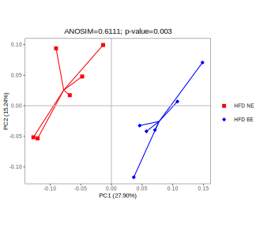

## Alpha diversity, HFD_MS vs HFD_NE

```{r, echo=FALSE, warning=FALSE, include=FALSE}
# Input table
alpha_data <- read.table(file = "02_alpha_diversity/alpha_diversity_e24251_r10000.txt",
                         header = TRUE,
                         sep = "\t")

# Filter groups HFD_MS vs HFD_NE
filt_alpha_data <- alpha_data %>% filter(grepl('DAG',
                                               Grupo_Experimental))

filt_alpha_data <- filt_alpha_data %>% filter(!grepl('_AE',
                                               Grupo_Experimental))

# Change name of groups
filt_alpha_data$Grupo_Experimental <- recode_factor(filt_alpha_data$Grupo_Experimental,
                                                    DAG = "HFD_MS",
                                                    DAG_AN = "HFD_NE")

filt_alpha_data <- filt_alpha_data %>% rename(group = "Grupo_Experimental")

# Define colors and shapes
colors <- c("#800000", # brown
            "#FB0207") # red

# P-value comparisons 
p_value <- list(c("HFD_MS",
                  "HFD_NE"))

# Observed otus boxplot
observed_otus_boxplot <- ggplot(filt_alpha_data,
                                aes(x = group,
                                    y = Observed.OTUs)) +
geom_boxplot(aes(color = group),
             outlier.shape = NA) +
geom_point(aes(color = group),
    size = 2,
    shape = 21,
    position = position_jitterdodge()) +
theme_test(base_size = 8,
           base_family = "Arial") +
labs(x = "",
    y = "Observed OTUs") +
scale_color_manual(values = colors) +
stat_compare_means(comparisons = p_value,
    method = "wilcox.test") +
theme(legend.position = "none")

# Creation of .svg
ggsave("02_alpha_diversity/observed_hfd-ms_hfd-ne.svg",
       width = 4,
       height = 4)
dev.off()

```

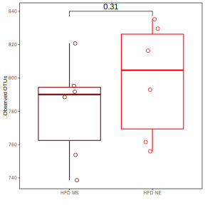

```{r, echo=FALSE, warning=FALSE, include=FALSE}
# Shannon boxplot
shannon_boxplot <- ggplot(filt_alpha_data,
                                aes(x = group,
                                    y = Shannon.Index)) +
geom_boxplot(aes(color = group),
             outlier.shape = NA) +
geom_point(aes(color = group),
    size = 2,
    shape = 21,
    position = position_jitterdodge()) +
theme_test(base_size = 8,
           base_family = "Arial") +
labs(x = "",
    y = "Shannon Index") +
scale_color_manual(values = colors) +
stat_compare_means(comparisons = p_value,
    method = "wilcox.test") +
theme(legend.position = "none")

# Creation of .svg
ggsave("02_alpha_diversity/shannon_hfd-ms_hfd-ne.svg",
       width = 4,
       height = 4)
dev.off()
```


## Beta diverstity, Unweighted UniFrac HFD_MS vs HFD_NE

```{r, echo=FALSE, warning=FALSE, include=FALSE}
# Input table and metadata
beta_data <- read.table(file = "03_beta_diversity/04_dag-sm_vs_dag-an/unweighted_unifrac_dm.txt",
                        sep="\t",
                        header=T,
                        row.names=1,
                        check.names=F)

metadata <- read.table(file = "metadata_allsamples.txt",
                       sep="\t",
                       header=T,
                       row.names=1,
                       check.names=F)

metadata <- metadata %>% filter(grepl("DAG", Grupo_Experimental)) %>%
  filter(!grepl("AE", Grupo_Experimental))

# Change the name of groups
metadata$Grupo_Experimental <- recode_factor(metadata$Grupo_Experimental,
                                             DAG = "HFD_MS",
                                             DAG_AN = "HFD_NE")

metadata <- metadata %>% mutate(Grupo_Experimental = factor(Grupo_Experimental,
                                                            levels=c(
                                                              "HFD_MS",
                                                              "HFD_NE")))

# Define colors and shapes
colors <- c("#800000", # brown
            "#FB0207") # red

shapes <- c(3, # +
            15) # square

# PCoA plot
ord <- cmdscale(beta_data,
                eig = T,
                k=ncol(beta_data)-1)

plt <- gg_ordiplot(ord,
                   groups = metadata$Grupo_Experimental,
                   conf = 0.95,
                   spiders = TRUE,
                   plot = FALSE,
                   ellipse = FALSE,
                   pt.size = 1)

plt <- plt$plot +
  geom_point(data = plt$df_ord,
             aes(x = x, y = y, color = Group, shape = Group),
             size = 2) +
scale_color_manual(values = colors) +
scale_shape_manual(values = shapes) +
labs(y = "PC2 (13.58%)",
     x = "PC1 (30.21%)",
    title = "ANOSIM=0.4926; p-value=0.009") +
geom_hline(yintercept=0,
    color = "gray") +
geom_vline(xintercept=0,
    color = "gray") +
theme_test(base_size = 8,
           base_family = "Arial") +
theme(legend.title = element_blank(),
    legend.position = "right",
    legend.background = element_blank(),
    plot.title = element_text(hjust = 0.5))

plt

# Creation of .svg
ggsave("03_beta_diversity/04_dag-sm_vs_dag-an/unweighted_unifrac_dag-sm_vs_dag-an.svg",
       width = 4.5,
       height = 4)
dev.off()
```

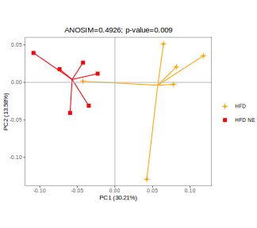

## Alpha diversity, HFD_MS vs HFD_EE

```{r, echo=FALSE, warning=FALSE, include=FALSE}
# Input table
alpha_data <- read.table(file = "02_alpha_diversity/alpha_diversity_e24251_r10000.txt",
                         header = TRUE,
                         sep = "\t")

# Filter groups HFD_MS vs HFD_EE
filt_alpha_data <- alpha_data %>% filter(grepl('DAG',
                                               Grupo_Experimental))

filt_alpha_data <- filt_alpha_data %>% filter(!grepl('_AN',
                                               Grupo_Experimental))

# Change name of groups
filt_alpha_data$Grupo_Experimental <- recode_factor(filt_alpha_data$Grupo_Experimental,
                                                    DAG = "HFD_MS",
                                                    DAG_AE = "HFD_EE")

filt_alpha_data <- filt_alpha_data %>% rename(group = "Grupo_Experimental")

# Define colors and shapes
colors <- c("#800000", # brown
            "#000000") # black

# P-value comparisons 
p_value <- list(c("HFD_MS",
                  "HFD_EE"))

# Observed otus boxplot
observed_otus_boxplot <- ggplot(filt_alpha_data,
                                aes(x = group,
                                    y = Observed.OTUs)) +
geom_boxplot(aes(color = group),
             outlier.shape = NA) +
geom_point(aes(color = group),
    size = 2,
    shape = 21,
    position = position_jitterdodge()) +
theme_test(base_size = 8,
           base_family = "Arial") +
labs(x = "",
    y = "Observed OTUs") +
scale_color_manual(values = colors) +
stat_compare_means(comparisons = p_value,
    method = "wilcox.test") +
theme(legend.position = "none")

# Creation of .svg
ggsave("02_alpha_diversity/observed_hfd-ms_hfd-ee.svg",
       width = 4,
       height = 4)
dev.off()
```


```{r, echo=FALSE, warning=FALSE, include=FALSE}
# Shannon boxplot
shannon_boxplot <- ggplot(filt_alpha_data,
                                aes(x = group,
                                    y = Shannon.Index)) +
geom_boxplot(aes(color = group),
             outlier.shape = NA) +
geom_point(aes(color = group),
    size = 2,
    shape = 21,
    position = position_jitterdodge()) +
theme_test(base_size = 8,
           base_family = "Arial") +
labs(x = "",
    y = "Shannon Index") +
scale_color_manual(values = colors) +
stat_compare_means(comparisons = p_value,
    method = "wilcox.test") +
theme(legend.position = "none")

# Creation of .svg
ggsave("02_alpha_diversity/shannon_hfd-ms_hfd-ee.svg",
       width = 4,
       height = 4)
dev.off()
```


## Beta diverstity, Unweighted UniFrac HFD_MS vs HFD_EE

```{r, echo=FALSE, warning=FALSE, include=FALSE}
# Input table and metadata
beta_data <- read.table(file = "03_beta_diversity/05_dag-sm_vs_dag-ae//unweighted_unifrac_dm.txt",
                        sep="\t",
                        header=T,
                        row.names=1,
                        check.names=F)

metadata <- read.table(file = "metadata_allsamples.txt",
                       sep="\t",
                       header=T,
                       row.names=1,
                       check.names=F)

metadata <- metadata %>% filter(grepl("DAG", Grupo_Experimental)) %>%
  filter(!grepl("AN", Grupo_Experimental))

# Change the name of groups
metadata$Grupo_Experimental <- recode_factor(metadata$Grupo_Experimental,
                                             DAG = "HFD_MS",
                                             DAG_AE = "HFD_EE")

metadata <- metadata %>% mutate(Grupo_Experimental = factor(Grupo_Experimental,
                                                            levels=c(
                                                              "HFD_MS",
                                                              "HFD_EE")))

# Define colors and shapes
colors <- c("#800000", # brown
            "#000000") # black

shapes <- c(3, # +
            18) # diamond

# PCoA plot
ord <- cmdscale(beta_data,
                eig = T,
                k=ncol(beta_data)-1)

plt <- gg_ordiplot(ord,
                   groups = metadata$Grupo_Experimental,
                   conf = 0.95,
                   spiders = TRUE,
                   plot = FALSE,
                   ellipse = FALSE,
                   pt.size = 1)

plt <- plt$plot +
  geom_point(data = plt$df_ord,
             aes(x = x, y = y, color = Group, shape = Group),
             size = 2) +
scale_color_manual(values = colors) +
scale_shape_manual(values = shapes) +
labs(y = "PC2 (16.14%)",
     x = "PC1 (22.51%)",
    title = "ANOSIM=0.3204; p-value=0.017") +
geom_hline(yintercept=0,
    color = "gray") +
geom_vline(xintercept=0,
    color = "gray") +
theme_test(base_size = 8,
           base_family = "Arial") +
theme(legend.title = element_blank(),
    legend.position = "right",
    legend.background = element_blank(),
    plot.title = element_text(hjust = 0.5))

plt

# Creation of .svg
ggsave("03_beta_diversity/05_dag-sm_vs_dag-ae/unweighted_unifrac_dag-sm_vs_dag-ae.svg",
       width = 4.5,
       height = 4)
dev.off()
```

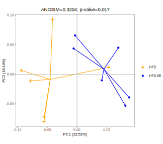


## Alpha diversity, HFD_MS vs HFD_NE vs HFD_EE
```{r, echo=FALSE, warning=FALSE, include=FALSE}
# Input table
alpha_data <- read.table(file = "02_alpha_diversity/alpha_diversity_e24251_r10000.txt",
                         header = TRUE,
                         sep = "\t")

# Filter groups HFD_MS vs HFD_NE
filt_alpha_data <- alpha_data %>% filter(grepl('DAG',
                                               Grupo_Experimental))

# Change name of groups
filt_alpha_data$Grupo_Experimental <- recode_factor(filt_alpha_data$Grupo_Experimental,
                                                    DAG = "HFD_MS",
                                                    DAG_AN = "HFD_NE",
                                                    DAG_AE = "HFD_EE")

filt_alpha_data <- filt_alpha_data %>% rename(group = "Grupo_Experimental")

# Define colors
colors <- c("#800000", # brown HFD_MS
            "#FB0207", # red HDF_NE
            "#000000") # black HFD_EE

# P-value comparisons 
p_value <- list(c("HFD_MS", "HFD_NE"),
                c("HFD_EE", "HFD_NE"),
                c("HFD_MS", "HFD_EE"))

# Observed otus boxplot
observed_otus_boxplot <- ggplot(filt_alpha_data,
                                aes(x = group,
                                    y = Observed.OTUs)) +
geom_boxplot(aes(color = group),
             outlier.shape = NA) +
geom_point(aes(color = group),
    size = 2,
    shape = 21,
    position = position_jitterdodge()) +
theme_test(base_size = 8,
           base_family = "Arial") +
labs(x = "",
    y = "Observed OTUs") +
scale_color_manual(values = colors) +
stat_compare_means(comparisons = p_value,
    method = "wilcox.test") +
theme(legend.position = "none")

# Creation of .svg
ggsave("02_alpha_diversity/observed_hfd-ms_hfd-ne_hfd-ee.svg",
       width = 4,
       height = 4)
dev.off()

```

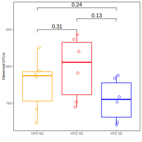

```{r, echo=FALSE, warning=FALSE, include=FALSE}
# Shannon boxplot
shannon_boxplot <- ggplot(filt_alpha_data,
                                aes(x = group,
                                    y = Shannon.Index)) +
geom_boxplot(aes(color = group),
             outlier.shape = NA) +
geom_point(aes(color = group),
    size = 2,
    shape = 21,
    position = position_jitterdodge()) +
theme_test(base_size = 8,
           base_family = "Arial") +
labs(x = "",
    y = "Shannon Index") +
scale_color_manual(values = colors) +
stat_compare_means(comparisons = p_value,
    method = "wilcox.test") +
theme(legend.position = "none")

# Creation of .svg
ggsave("02_alpha_diversity/shannon_hfd-ms_hfd-ne_hfd-ee.svg",
       width = 4,
       height = 4)
dev.off()
```

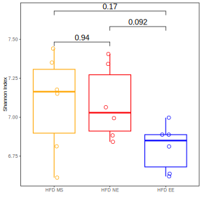

## Beta diverstity, Unweighted UniFrac HFD_MS vs HFD_EE

```{r, echo=FALSE, warning=FALSE, include=FALSE}
# Input table and metadata
beta_data <- read.table(file = "03_beta_diversity/06_beta_dag-sm_dag-an_dag-ae/unweighted_unifrac_dm.txt",
                        sep="\t",
                        header=T,
                        row.names=1,
                        check.names=F)

metadata <- read.table(file = "metadata_allsamples.txt",
                       sep="\t",
                       header=T,
                       row.names=1,
                       check.names=F)

metadata <- metadata %>% filter(grepl("DAG", Grupo_Experimental))

# Change name of groups
metadata$Grupo_Experimental <- recode_factor(metadata$Grupo_Experimental,
                                             DAG = "HFD_MS",
                                             DAG_AN = "HFD_NE",
                                             DAG_AE = "HFD_EE")

# Define colors and shapes
colors <- c("#800000", # brown HFD_MS
            "#FB0207", # red HDF_NE
            "#000000") # black HFD_EE

shapes <- c(3, # + HFD_MS
            15, # square HFD_EE
            18) # diamond HDF_NE

# PCoA plot
ord <- cmdscale(beta_data,
                eig = T,
                k=ncol(beta_data)-1)

plt <- gg_ordiplot(ord,
                   groups = metadata$Grupo_Experimental,
                   conf = 0.95,
                   spiders = TRUE,
                   plot = FALSE,
                   ellipse = FALSE,
                   pt.size = 1)

plt <- plt$plot +
  geom_point(data = plt$df_ord,
             aes(x = x, y = y, color = Group, shape = Group),
             size = 2) +
scale_color_manual(values = colors) +
scale_shape_manual(values = shapes) +
labs(y = "PC2 (15.31%)",
     x = "PC1 (20.21%)",
    title = "ANOSIM=0.4728; p-value=0.001") +
geom_hline(yintercept=0,
    color = "gray") +
geom_vline(xintercept=0,
    color = "gray") +
theme_test(base_size = 8,
           base_family = "Arial") +
theme(legend.title = element_blank(),
    legend.position = "right",
    legend.background = element_blank(),
    plot.title = element_text(hjust = 0.5))

plt

# Creation of .svg
ggsave("03_beta_diversity/06_beta_dag-sm_dag-an_dag-ae/unweighted_unifrac_dag-sm_vs_dag-an_dag-ae.svg",
       width = 4.5,
       height = 4)
dev.off()
```

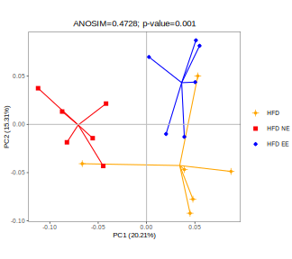
